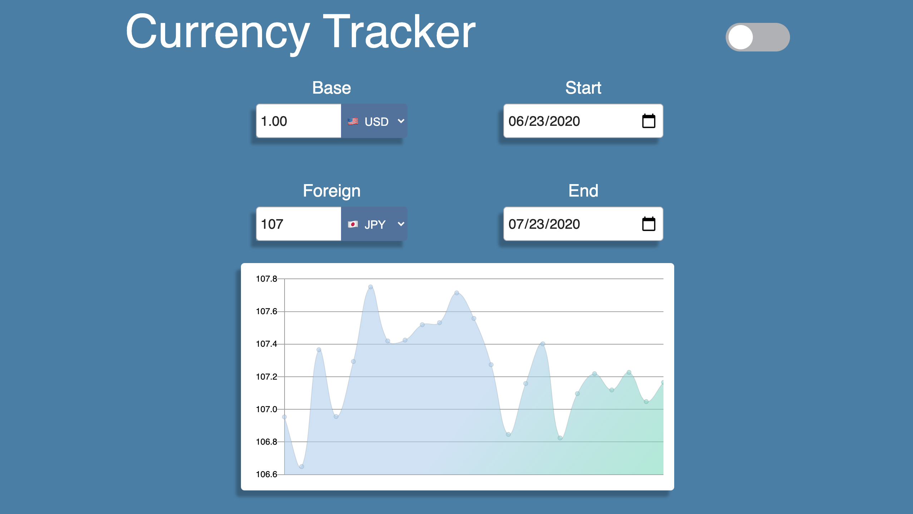
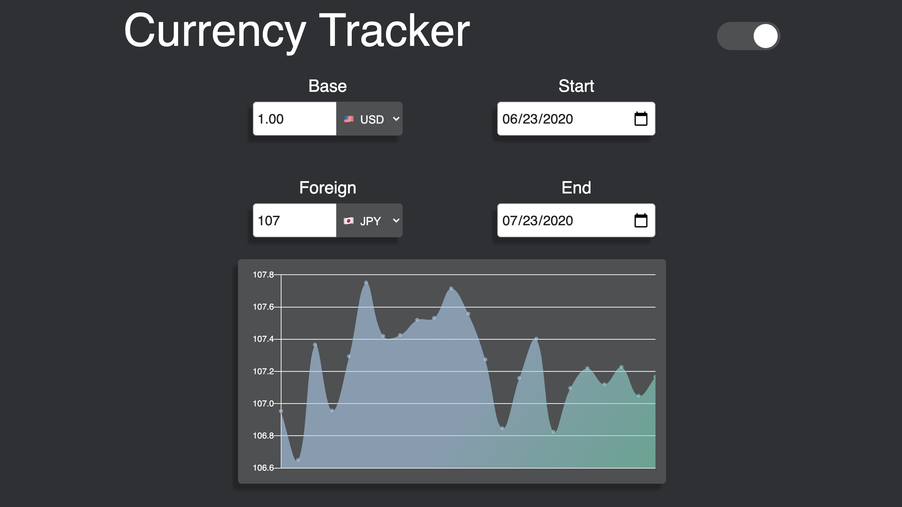

# Currency Tracker React App

This is an app I created to track the daily exchange rate between different currencies. There are 33 available currencies and it can display data for some currencies from as far back as 1999. The base exchange rate in the graph is set to $1.00 USD. There is both a light and dark mode available. Data comes from the  European Central Bank. 

<a href="https://ricardo-gonzalez-villegas.github.io/currency-tracker"/>View it here.</a>
<section>
<h2>Technologies Used<h2/>
JSS, JSX, Javascript, React, Chart.JS, Moment.js, ExchangeRates API,
</section>
 
<h1>Home Page</h1>

<h1>Dark Mode</h1>

User can switch between light and dark mode.

<h1>Choose From 33 Currencies</h1>

<h1>Data From Different Time Periods</h1>

